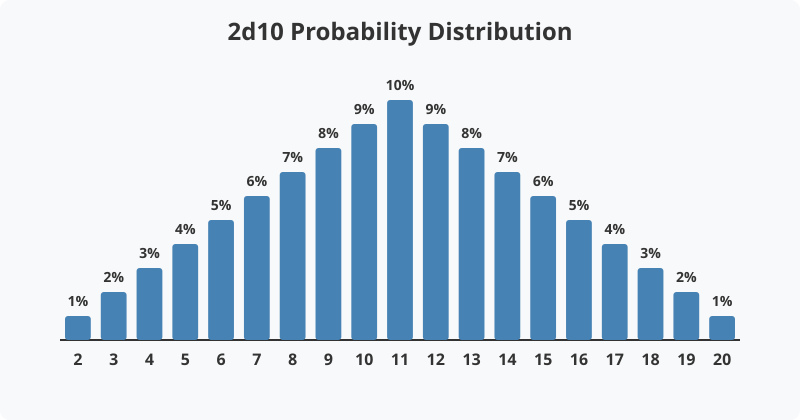
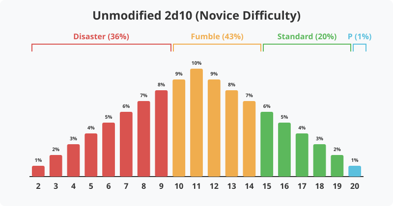
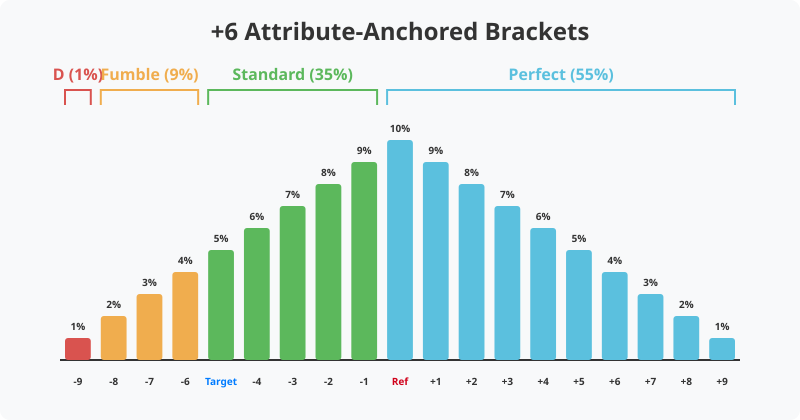
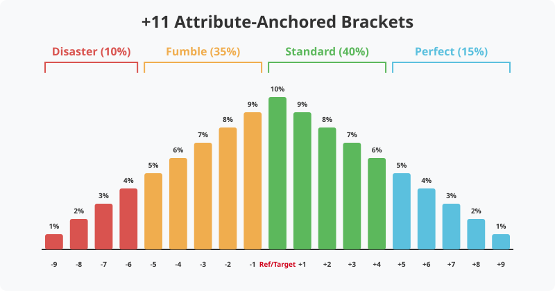
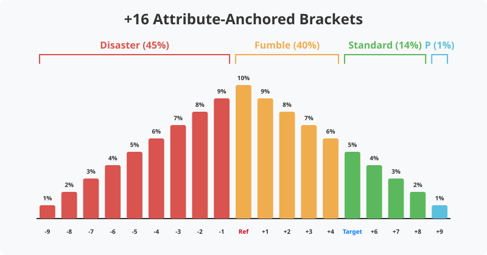
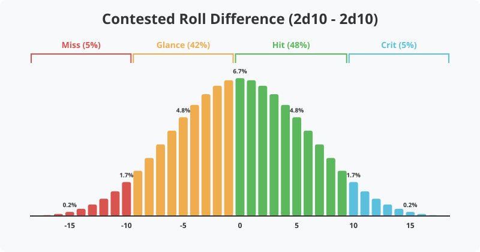

Game Philosophy
===============

[Game Name] is constructed upon a deliberate set of foundational ideals that define its intended experience. These core philosophies articulate what tabletop roleplaying should look, feel, and play like at the table. To ensure these ideals remain more than just aspirational words, the systematic and mathematical design choices woven into the game act as the active framework that reinforces and supports these philosophies during actual, moment-to-moment play.

Core Philosophies
-----------------

1. **Be Fun. Duh.** (Easier said than done, of course.)
2. **Maintain Narrative Balance:** A tabletop RPG should balance mechanical structure with narrative freedom. Rules should not make roleplaying too restrictive, nor should their absence allow a meaningless environment where "anything goes."
3. **Maintain Complexity Balance:** A tabletop RPG should balance gameplay depth with a streamlined experience. Rules should be interactive enough to inspire players to create strategies, while remaining mentally trackable.
4. **Randomness is Not Absolute:** Randomness should serve the narrative, not dictate it. Dice rolls are meant to generate interesting outcomes, but players' actions and resources should be the primary drivers of success.
5. **Low Bar of Entry:** A tabletop RPG should be accessible to everyone. The barrier to entry — whether mechanical, financial, or material — should be as low as possible to encourage a wide audience to adopt and play the game.

Be Fun. Duh.
~~~~~~~~~~~~

First and foremost, a tabletop RPG should be fun. While this sounds obvious, game design often falls into the trap of prioritizing "realism" or "simulation" over an enjoyable player experience. Every rule, from combat to narrative exertion, should exist to facilitate dramatic tension, heroic moments, and engaging decision-making. If a mechanic requires tedious bookkeeping without delivering an emotional or tactical payoff, it should be modified or discarded entirely.

Maintain Narrative Balance
~~~~~~~~~~~~~~~~~~~~~~~~~~

A tabletop RPG is fundamentally a collaborative story, and the rules should act as the scaffolding for that narrative — not a straightjacket. There must be enough mechanical structure to make player choices matter and to resolve conflicts fairly, but not so many restrictive rules that they stifle creativity. The GM should feel empowered to bend the fiction logically, while players should feel confident that the system's framework will reliably support, rather than hinder, their creative problem-solving. Neither extreme — "rules-lawyering" nor "make it up as we go" — serves a satisfying long-term campaign. 

Maintain Complexity Balance
~~~~~~~~~~~~~~~~~~~~~~~~~~~

Depth should emerge from the interplay of elegant core mechanics, rather than an overwhelming volume of niche, situational rules. A resilient system provides players with meaningful levers to pull — such as spending resources, invoking traits, and making tactical decisions — without requiring them to consult tables or calculate excessive modifiers on every single turn. A streamlined core engine leaves players with more cognitive bandwidth to focus on rich roleplaying, character action, and team strategy. 

.. _randomness_philosophy:

Randomness is Not Absolute
~~~~~~~~~~~~~~~~~~~~~~~~~~

Dice add unpredictability and excitement to a game, but they should not arbitrarily punish competence. In a heroic narrative, highly trained experts shouldn't fail purely due to bad luck on a flat probability curve. A well-designed system utilizes mechanics and deliberate resource expenditure to allow players to actively mitigate their own bad luck. Randomness exists solely to introduce unexpected complications and triumphs, not to dictate the story or undermine player agency.

Low Bar of Entry
~~~~~~~~~~~~~~~~

The barrier to entry for any tabletop roleplaying game should be as low as possible. A game should bridge the gap between imagination and play without requiring players to navigate a gauntlet of financial or material hurdles. When a system demands specialized, proprietary dice, expensive physical tokens, or a library of high-cost mandatory rulebooks, it risks excluding potential players and stifling the growth of its community. A philosophy of accessibility ensures that a game can be adopted by anyone with a few basic tools, prioritizing the shared narrative experience over the consumption of exclusive products. True success in game design is measured by the ease with which a group can sit down and begin their story.

Design Choices
--------------

The core philosophies outlined above act as the ultimate litmus test for every rule and systemic decision in [Game Name]. To successfully balance narrative freedom with tactical depth, [Game Name]'s underlying engine is built on principles that actively push players toward engaging roleplay while remaining mathematically reliable behind the screen. The following choices detail how these high-level philosophical goals are translated directly into tangible, tabletop mechanics.

Modularity
~~~~~~~~~~

[Game Name] is designed as a modular framework rather than a rigid set of instructions. Every rule and subsystem is constructed to be removable, replaceable, or adjustable to fit the specific needs of a playgroup. While certain "Core Rules" provide the fundamental engine for the game, they are not immutable; if a rule does not serve the intended experience of a group, it can and should be changed. This modularity ensures a low bar of entry by allowing new players to start with only the most essential rules and gradually introduce complexity as they become more comfortable with the system.

This modularity empowers players and GMs to collaboratively build a game that is enjoyable by fine-tuning the balance between mechanical depth and streamlined play. Because every playgroup possesses different preferences and thresholds for complexity, [Game Name] provides the tools to scale the ruleset up or down, ensuring that the system always supports, rather than dictates, the table's unique style of play.

Standardized Materials
~~~~~~~~~~~~~~~~~~~~~~

[Game Name] is specifically designed to be played with standard ten-sided dice (d10), common hobby supplies, and easily accessible digital or physical character sheets. By rejecting proprietary components or mandatory physical accessories, the game removes the financial friction often associated with entering a new system. This choice ensures that any group can begin their story with minimal investment, focusing entirely on the narrative rather than the tools.

Math-Light Design
~~~~~~~~~~~~~~~~~

[Game Name] prioritizes narrative momentum over complex arithmetic. Players derive their advantages from their core **Attributes** and resource management rather than tracking constantly shifting numeric penalties. This math-light approach further lowers the bar of entry by reducing the cognitive load required to learn and play the system, ensuring that the rules facilitate play rather than hindering it with excessive calculation.

The GM avoids imposing arbitrary negative modifiers. Instead, the GM alters the narrative stakes or demands resource expenditure (**Stamina** or **Essence**) to represent difficulty. 

.. _bell_curve_philosophy:

The 2d10 Bell Curve vs. Flat Probability
~~~~~~~~~~~~~~~~~~~~~~~~~~~~~~~~~~~~~~~~

[Game Name] utilizes a 2d10 bell curve rather than a flat, single-die probability (such as a 1d20). Flat probabilities create a reality where outcomes are wildly chaotic, treating a master and a novice to the same massive swings of fortune. 

The bell curve ensures that average outcomes happen consistently in [Game Name]. A character's **Attributes** act as the deciding factor in success, allowing players to trust their character's competence. 

.. _outcome_brackets_philosophy:

Outcome Brackets and Narrative Agency
~~~~~~~~~~~~~~~~~~~~~~~~~~~~~~~~~~~~~

[Game Name] utilizes distinct Outcome Brackets to enforce narrative momentum. Every action explicitly results in a narrative shift, tying directly to the fundamental mathematics of the 2d10 engine. Providing multiple outcome states — rather than a restrictive binary pass-fail system — dramatically increases narrative freedom by allowing the GM and players to explore a far richer spectrum of consequences, costs, and triumphs. To ensure these outcomes have mechanical "teeth," the system encourages the use of **Statuses** (both positive and negative) to represent the persistent ripple effects of a roll beyond its initial resolution.

These difficulty brackets are designed using the :ref:`Attribute-Anchored Brackets <anchored_brackets_philosophy>` approach, ensuring that mathematical expectations and narrative consequences remain in perfect sync across all levels of play.

For unopposed challenges, the system divides outcomes into four states: Disaster, Fumble, Standard, and Perfect. The target numbers for these brackets shift based on the chosen Difficulty. As an example, the graph below visualizes the unmitigated probability of these brackets for a standard **Novice** Difficulty check, assuming a player relies entirely on raw mechanics with no attribute modifiers or resource exertion.

This steep baseline — where raw chance heavily favors a Fumble or Disaster — is a core design choice. It compels players to rely heavily on their character's **Attributes**, expend **Stamina** or **Essence**, and creatively invoke **Persona Tags** to shift the mathematical curve toward Standard and Perfect outcomes.

.. _anchored_brackets_philosophy:

Attribute-Anchored Brackets
^^^^^^^^^^^^^^^^^^^^^^^^^^^

By anchoring the Standard bracket to a character's relevant **Attribute** plus the mathematical average of 2d10 (11), [Game Name] — or the GM when creating custom brackets — can create a challenge that precisely mirrors a character's expected performance. This "Reference" (Ref) point creates a fair, balanced challenge where the character has an approximately 50% chance to achieve a Standard success or better. (At the end of this section there are concrete examples of this methodology.) **Note:** Regardless of the specific anchor, a natural roll of 2 is always a Disaster, and a natural roll of 20 is always a Perfect.

[Game Name] and GMs can build the surrounding brackets relative to this anchor:
* **Fumble:** Ref - 5
* **Standard:** Ref
* **Perfect:** Ref + 5

Choosing a higher anchor (e.g., Ref + 3) shifts the requirement toward the "tails" of the bell curve, making success significantly harder. Furthermore, the width of the brackets dictates narrative "volatility." Widening the gap (e.g., +/- 7) makes Standard outcomes overwhelmingly common, while compressing the gap (e.g., +/- 3) creates a high-stakes environment where spectacular triumphs and disasters become much more frequent.

**What does this mean?**

**+11 Example:**
   Suppose a character with a **Strength** of 4 is attempting a challenging climb. To create a task that feels balanced for this character's competence, the GM anchors the **Standard** success bracket at 15 (Attribute 4 + 11). This defines the other brackets as **Fumble** (10) and **Perfect** (20). 

   Because the mathematical average of 2d10 is 11, this character only needs to roll a "standard" average result (11 + 4 = 15) to achieve a Standard success. This anchoring results in a 55% probability of an unmitigated success (rolling 11 or higher on the dice) and a 45% probability of a success with significant consequences (rolling 10 or less). Depending on your playgroup's appetite for risk and the desired "grittiness" of the campaign, this balance may be perceived as either encouragingly heroic or punishingly difficult. It ensures that a character's inherent expertise directly translates into a higher probability of success, making what would be difficult for a novice feel reliable for a veteran.

**+16 Example:**
   Alternatively, anchoring the **Standard** bracket at 20 (Attribute 4 + 16) creates a much more daunting challenge. This results in only a 15% probability of an unmitigated success (rolling 16 or higher), leaving an 85% probability of a success with consequences or a failure. This represents an "Expert" difficulty where even competent characters are expected to struggle or incur costs unless they leverage additional resources, making it ideal for high-stakes climaxes or extremely hazardous environments.

..

..

.. _contested_roll_statistics:

Contested Roll Statistics
^^^^^^^^^^^^^^^^^^^^^^^^^

In combat and direct opposition, the system relies on the mathematical difference between the attacker's roll and the defender's roll to determine the narrative outcome: Miss, Glance, Hit, or Critical. 

By grounding this system in the difference of two 2d10 checks, without any modifiers, it mathematically centers the results over 0, naturally generating a clean bell curve of contested outcomes with a realistic chance of spectacular criticals without requiring external charts.

Crucially, because a mathematical difference of exactly 0 is designated as a **Hit**, the system deliberately biases deadlocks toward the attacker. By shifting combat momentum forward on ties, the game prevents stagnant, infinite defensive standoffs and ensures that **Health** pools deplete relentlessly toward a narrative conclusion.

